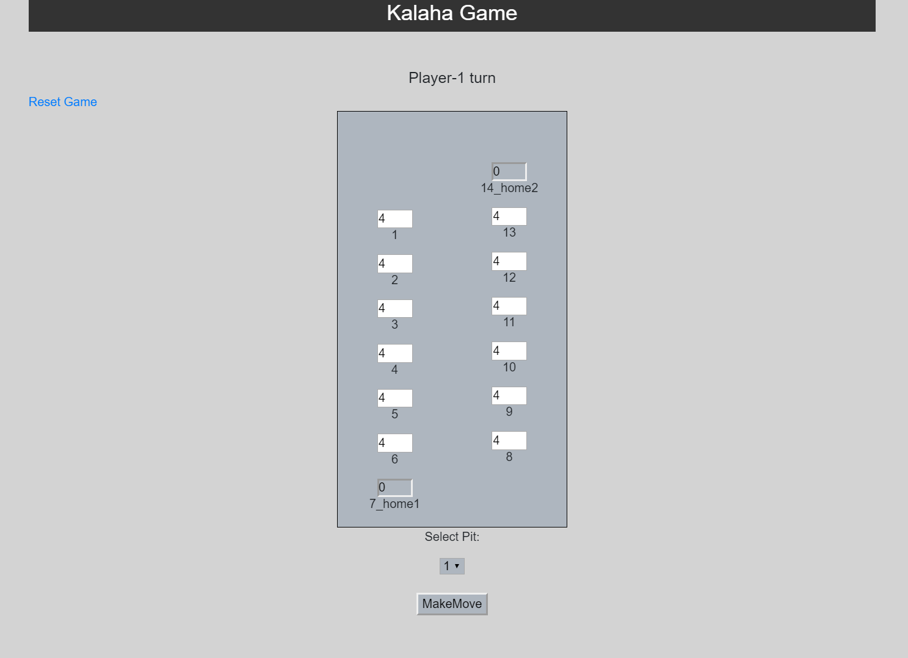

# 'n' stones - Kalaha Game

A Java RESTful Web Service and web application that runs a game of n-stones Kalaha. This web based application enables 2 human players to play the game.

## About

Technologies used : Java, Spring Boot, Rest API, Thymeleaf

Database : In memory H2 database

## Game Rules with implementations

Each of the two players has 6 pits in front of him/her. To the right of the six pits, each player has a larger pit, his
Kalaha or house. At the start of the game, 'n' number of stones can be put in each pit.

Create a new game and a new game will be created with default pits and stones i.e. 6 pits each with 'n' stones.
Pits 1 to 6 are for Player One and Pits 8 to 13 are for Player two.

'n' can be configured within the application before running the application.

Player One is assumed to make the first move from the range of 1 to 6 pits.

### Errors for Invalid Moves for Rest Service

- Player One is supposed to make the first move with pits from the range - 1 to 6 otherwise an error would be returned.
- Every alternate move should be from the different player, unless the move is repeated in certain cases. Error will be returned otherwise.
- If invalid pit Id is given or pit with 0 stones in it is given, error would be returned.

### Code as per the functionality 

#### Create game

Initial number of stones can be configured in `application.properties` under the property - 

```
kalaha.noOfStones=6
```

URL's within the game - 

##### Web Based Application - 
Start a new Game - `http://localhost:8080/start`

Select on screen options to make a move / reset the game.



##### Restful Service - 
Start a new Game - `http://localhost:8080/`

    Response:
        ```{
               "id": 1,
               "pitMap": {
                   "1": {
                       "id": 2,
                       "player": "PLAYER1",
                       "stones": 4,
                       "position": 1,
                       "pitType": "PIT"
                   },
                   "2": {
                       "id": 3,
                       "player": "PLAYER1",
                       "stones": 4,
                       "position": 2,
                       "pitType": "PIT"
                   },
                   "3": {
                       "id": 4,
                       "player": "PLAYER1",
                       "stones": 4,
                       "position": 3,
                       "pitType": "PIT"
                   },
                   "4": {
                       "id": 5,
                       "player": "PLAYER1",
                       "stones": 4,
                       "position": 4,
                       "pitType": "PIT"
                   },
                   "5": {
                       "id": 6,
                       "player": "PLAYER1",
                       "stones": 4,
                       "position": 5,
                       "pitType": "PIT"
                   },
                   "6": {
                       "id": 7,
                       "player": "PLAYER1",
                       "stones": 4,
                       "position": 6,
                       "pitType": "PIT"
                   },
                   "7": {
                       "id": 8,
                       "player": "PLAYER1",
                       "stones": 0,
                       "position": 7,
                       "pitType": "HOME"
                   },
                   "8": {
                       "id": 9,
                       "player": "PLAYER2",
                       "stones": 4,
                       "position": 8,
                       "pitType": "PIT"
                   },
                   "9": {
                       "id": 10,
                       "player": "PLAYER2",
                       "stones": 4,
                       "position": 9,
                       "pitType": "PIT"
                   },
                   "10": {
                       "id": 11,
                       "player": "PLAYER2",
                       "stones": 4,
                       "position": 10,
                       "pitType": "PIT"
                   },
                   "11": {
                       "id": 12,
                       "player": "PLAYER2",
                       "stones": 4,
                       "position": 11,
                       "pitType": "PIT"
                   },
                   "12": {
                       "id": 13,
                       "player": "PLAYER2",
                       "stones": 4,
                       "position": 12,
                       "pitType": "PIT"
                   },
                   "13": {
                       "id": 14,
                       "player": "PLAYER2",
                       "stones": 4,
                       "position": 13,
                       "pitType": "PIT"
                   },
                   "14": {
                       "id": 15,
                       "player": "PLAYER2",
                       "stones": 0,
                       "position": 14,
                       "pitType": "HOME"
                   }
               },
               "status": 0,
               "nextMove": 1,
               "winner": null
           }```
        
Make a move - `http://localhost:8080/makeMove/gameId/{gameId}/pitId/{pitId}`
    
    Response:
        ```{
               "id": 1,
               "pitMap": {
                   "1": {
                       "id": 2,
                       "player": "PLAYER1",
                       "stones": 4,
                       "position": 1,
                       "pitType": "PIT"
                   },
                   "2": {
                       "id": 3,
                       "player": "PLAYER1",
                       "stones": 0,
                       "position": 2,
                       "pitType": "PIT"
                   },
                   "3": {
                       "id": 4,
                       "player": "PLAYER1",
                       "stones": 5,
                       "position": 3,
                       "pitType": "PIT"
                   },
                   "4": {
                       "id": 5,
                       "player": "PLAYER1",
                       "stones": 5,
                       "position": 4,
                       "pitType": "PIT"
                   },
                   "5": {
                       "id": 6,
                       "player": "PLAYER1",
                       "stones": 5,
                       "position": 5,
                       "pitType": "PIT"
                   },
                   "6": {
                       "id": 7,
                       "player": "PLAYER1",
                       "stones": 5,
                       "position": 6,
                       "pitType": "PIT"
                   },
                   "7": {
                       "id": 8,
                       "player": "PLAYER1",
                       "stones": 0,
                       "position": 7,
                       "pitType": "HOME"
                   },
                   "8": {
                       "id": 9,
                       "player": "PLAYER2",
                       "stones": 4,
                       "position": 8,
                       "pitType": "PIT"
                   },
                   "9": {
                       "id": 10,
                       "player": "PLAYER2",
                       "stones": 4,
                       "position": 9,
                       "pitType": "PIT"
                   },
                   "10": {
                       "id": 11,
                       "player": "PLAYER2",
                       "stones": 4,
                       "position": 10,
                       "pitType": "PIT"
                   },
                   "11": {
                       "id": 12,
                       "player": "PLAYER2",
                       "stones": 4,
                       "position": 11,
                       "pitType": "PIT"
                   },
                   "12": {
                       "id": 13,
                       "player": "PLAYER2",
                       "stones": 4,
                       "position": 12,
                       "pitType": "PIT"
                   },
                   "13": {
                       "id": 14,
                       "player": "PLAYER2",
                       "stones": 4,
                       "position": 13,
                       "pitType": "PIT"
                   },
                   "14": {
                       "id": 15,
                       "player": "PLAYER2",
                       "stones": 0,
                       "position": 14,
                       "pitType": "HOME"
                   }
               },
               "status": 0,
               "nextMove": 2,
               "winner": null
           }```

In any of the error scenarios extra fields would be returned in the response along with the id, url and the current status of the pits - 
    
    Response:
        ```
        {
           {
               "timestamp": "2020-04-01T09:11:26.796+0000",
               "status": 500,
               "error": "Internal Server Error",
               "message": "Invalid Pit selected. Please select pits from 8-13",
               "path": "/makeMove/gameId/1/pitId/2"
           }
        ```

In case of a valid move, appropriate pits would be updated and the response would be generated - 
    
    Response:
    ```{
           "id": 1,
           "pitMap": {
               "1": {
                   "id": 2,
                   "player": "PLAYER1",
                   "stones": 4,
                   "position": 1,
                   "pitType": "PIT"
               },
               "2": {
                   "id": 3,
                   "player": "PLAYER1",
                   "stones": 0,
                   "position": 2,
                   "pitType": "PIT"
               },
               "3": {
                   "id": 4,
                   "player": "PLAYER1",
                   "stones": 5,
                   "position": 3,
                   "pitType": "PIT"
               },
               "4": {
                   "id": 5,
                   "player": "PLAYER1",
                   "stones": 5,
                   "position": 4,
                   "pitType": "PIT"
               },
               "5": {
                   "id": 6,
                   "player": "PLAYER1",
                   "stones": 5,
                   "position": 5,
                   "pitType": "PIT"
               },
               "6": {
                   "id": 7,
                   "player": "PLAYER1",
                   "stones": 5,
                   "position": 6,
                   "pitType": "PIT"
               },
               "7": {
                   "id": 8,
                   "player": "PLAYER1",
                   "stones": 0,
                   "position": 7,
                   "pitType": "HOME"
               },
               "8": {
                   "id": 9,
                   "player": "PLAYER2",
                   "stones": 0,
                   "position": 8,
                   "pitType": "PIT"
               },
               "9": {
                   "id": 10,
                   "player": "PLAYER2",
                   "stones": 5,
                   "position": 9,
                   "pitType": "PIT"
               },
               "10": {
                   "id": 11,
                   "player": "PLAYER2",
                   "stones": 5,
                   "position": 10,
                   "pitType": "PIT"
               },
               "11": {
                   "id": 12,
                   "player": "PLAYER2",
                   "stones": 5,
                   "position": 11,
                   "pitType": "PIT"
               },
               "12": {
                   "id": 13,
                   "player": "PLAYER2",
                   "stones": 5,
                   "position": 12,
                   "pitType": "PIT"
               },
               "13": {
                   "id": 14,
                   "player": "PLAYER2",
                   "stones": 4,
                   "position": 13,
                   "pitType": "PIT"
               },
               "14": {
                   "id": 15,
                   "player": "PLAYER2",
                   "stones": 0,
                   "position": 14,
                   "pitType": "HOME"
               }
           },
           "status": 0,
           "nextMove": 1,
           "winner": null
       }```


## Running the application

There are several ways to run the application. You can run it from the command line with included Maven Wrapper or Maven.

### Maven

Open a terminal and run the following commands to ensure that you have valid versions of Java and Maven installed:

```bash
$ java -version
java version "1.8.0_152"
Java(TM) SE Runtime Environment (build 1.8.0_152-b16)
Java HotSpot(TM) 64-Bit Server VM (build 25.152-b16, mixed mode)
```

```bash
$mvn -v
Apache Maven 3.5.2 (138edd61fd100ec658bfa2d307c43b76940a5d7d; 2017-10-18T13:28:13+05:30)
Maven home: D:\softwares\apache-maven-3.5.2\bin\..
Java version: 1.8.0_152, vendor: Oracle Corporation
Java home: C:\Program Files\Java\jdk1.8.0_152\jre
```
#### Docker

```
docker build -t kalaha .
docker run -d -p 8080:8080 kalaha
```

#### Using the Maven Plugin

The Spring Boot Maven plugin includes a run goal that can be used to quickly compile and run your application. 
Applications run in an exploded form, as they do in your IDE. 
The following example shows a typical Maven command to run a Spring Boot application:
 
```bash
$ mvn spring-boot:run
``` 

To exit the application, press **ctrl-c**.