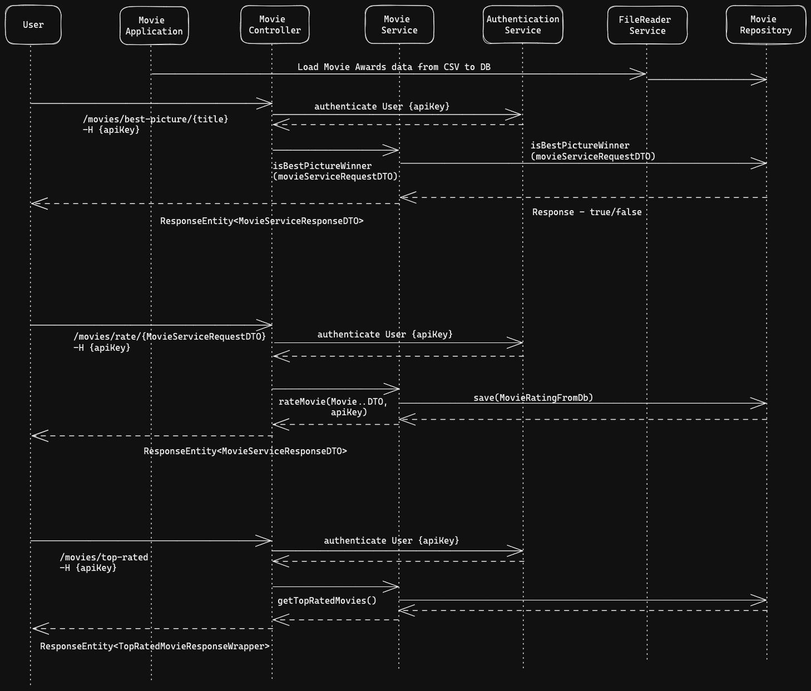

# 'movies-service' 

## Solution

The solution uses Microservices architecture: 
- The `Controller` layer receives the user requests, validates the incoming requests then calls the service layer to start the handling of the request.
- The `Service` layer handles the incoming request and connects to the Repository and the Gateway Service.
- The `Gateway service` handles the communication with the external OMDb API and also handles the error cases for example, outages in external API.
- `JPA repository` handles the persistence of the ORM mapped objects into a relational database.
- Spring's `WebClient` is used to synchronously connect to the external API from the gateway service.
- Sample database schema is added to represent the table structure at `movies-schema.sql`

## Design Patterns

- Minimum Java 17, Spring boot 3.0.4, H2 in-memory database.
- `Builder Pattern` to construct objects step by step throughout the API.
- `Gateway pattern` for external systems interactions. Good for Separation of concerns while interacting with
  multiple external services for added operations like mapping the DTOs, making connections etc.
  More external systems can be added later on and associated with the Gateway instead of changing any configuration in the main Service.
- `Data Transfer Objects (DTO)` to transfer data between different layers and encapsulate all the required details within an object.

## Implementation Points 

- When the database is initially populated with data from the CSV, random average ratings are generated for all movie records to ensure that there is some data available for all movies. This is done in case we want to view top-rated movies based on ratings. However, in a production environment, the initial average rating should be set to 0.
- When a user rates a movie, a new record is added to the movie_users_ratings table, and the existing row would be updated since a user can update their own rating for the movie. Simultaneously, the average rating for the movie is updated in the Movie table.
- When another user rates the same movie, the average rating stored in the Movie table will be recalculated and updated accordingly.

## Sequence Diagram
